  
# Hello!👋, I'm Krishna | Automate⚙️, Scale☁️ & Secure🛡️

## About Me 👨‍💻

🔥 I will be there where engineering, security, and operations meet and stay hands-on by doing projects and experiments ( *Every challenge is an opportunity to learn something new* )

🯠<b>Focus Areas</b>

- **DevOps & CI/CD**: Streamlining development workflows and deployment pipelines
- **DevSecOps**: Integrating security practices into every stage of the development lifecycle  
- **Cloud Architecture**: Designing and implementing robust multi-cloud solutions
- **Site Reliability Engineering**: Ensuring high availability and performance at scale
- **Platform Engineering**: Building developer-centric platforms and tooling

### ☁️ **Cloud Platforms**

### 🔧 **DevOps & Infrastructure**

**Container Technologies:**

**Infrastructure as Code:**

**CI/CD & Automation:**

### 🔐 **Security & Monitoring**

**Monitoring & Observability:**

**Security Tools:**

### 💻 **Programming & Scripting**

### 🗄️ **Databases & Message Queues**

```mermaid
graph LR
    subgraph main[" "]
        direction TB
        
        subgraph dev["🔧 DEVELOPMENT PHASE"]
            direction LR
            subgraph plan["📋 PLAN & CODE"]
                A1["🔀 Git<br/>Version Control"]
                A2["📊 Jira<br/>Project Management"]
                A3["💻 VS Code<br/>IDE & Development"]
            end
        end
        
        subgraph ci["🚀 CONTINUOUS INTEGRATION"]
            direction LR
            B1["🔨 Jenkins<br/>Build Server"]
            B2["⚡ GitHub Actions<br/>Cloud Native CI"]
            B3["🦊 GitLab CI<br/>Integrated Pipeline"]
            B4["📦 Build Artifacts<br/>Container Images"]
        end
        
        subgraph security["🛡️ SECURITY & COMPLIANCE"]
            direction TB
            subgraph sast["Static Analysis"]
                C1["🔍 SonarQube<br/>Code Quality"]
                C2["🔐 Snyk/Trivy<br/>Vulnerability Scan"]
            end
            subgraph runtime["Runtime Security"]
                C3["🐳 Container Scan<br/>Image Security"]
                C4["📋 OPA<br/>Policy as Code"]
            end
        end
        
        subgraph cd["🚢 CONTINUOUS DEPLOYMENT"]
            direction LR
            D1["🔄 ArgoCD<br/>GitOps Delivery"]
            D2["🌊 Flux<br/>GitOps Controller"]
            D3["🎯 Spinnaker<br/>Multi-Cloud Deploy"]
        end
        
        subgraph platform["⚙️ PLATFORM & ORCHESTRATION"]
            direction TB
            P1["☸️ Kubernetes<br/>Container Orchestration"]
            P2["🕸️ Service Mesh<br/>Istio/Linkerd"]
            P3["🏗️ Backstage<br/>Developer Portal"]
        end
        
        subgraph monitoring["📊 OBSERVABILITY & SRE"]
            direction TB
            subgraph metrics["Metrics & Monitoring"]
                E1["📈 Prometheus<br/>Metrics Collection"]
                E2["📊 Grafana<br/>Visualization"]
            end
            subgraph logging["Logging & Tracing"]
                E3["📝 ELK Stack<br/>Log Analytics"]
                E4["🔍 Jaeger<br/>Distributed Tracing"]
            end
            E5["🚨 PagerDuty<br/>Incident Management"]
        end
        
        subgraph cloud["☁️ CLOUD INFRASTRUCTURE"]
            direction TB
            CL1["🌐 Multi-Cloud<br/>AWS • GCP • Azure"]
            CL2["🏗️ Terraform<br/>Infrastructure as Code"]
            CL3["⚙️ Ansible<br/>Configuration Management"]
        end
    end
    
    %% Enhanced Flow Connections
    A1 -.-> B1
    A1 -.-> B2  
    A1 -.-> B3
    
    B1 --> B4
    B2 --> B4
    B3 --> B4
    
    B4 ==> C1
    B4 ==> C2
    C1 --> C3
    C2 --> C3
    
    C3 ==> D1
    C4 --> P1
    
    D1 ==> P1
    D2 --> P1
    D3 --> P1
    
    P1 ==> E1
    P1 --> E3
    P2 --> E4
    
    E1 --> E2
    E1 --> E5
    E3 --> E5
    E4 --> E2
    
    CL2 ==> CL1
    CL3 --> CL1
    P1 -.-> CL1
    
    %% Modern Styling with Better Color Scheme
    %% Development Phase - Purple Theme
    style A1 fill:#8B5FBF,stroke:#6A4C8C,stroke-width:3px,color:#fff
    style A2 fill:#9A6FB0,stroke:#7A5690,stroke-width:3px,color:#fff
    style A3 fill:#AB7FA1,stroke:#8B6581,stroke-width:3px,color:#fff
    
    %% CI Phase - Blue Theme
    style B1 fill:#4A90E2,stroke:#3570B2,stroke-width:3px,color:#fff
    style B2 fill:#5BA0F2,stroke:#3B80D2,stroke-width:3px,color:#fff
    style B3 fill:#6CB0FF,stroke:#4C90DF,stroke-width:3px,color:#fff
    style B4 fill:#7DC0FF,stroke:#5DA0EF,stroke-width:4px,color:#fff
    
    %% Security Phase - Red/Orange Theme
    style C1 fill:#E74C3C,stroke:#C73E1D,stroke-width:3px,color:#fff
    style C2 fill:#F39C12,stroke:#E67E22,stroke-width:3px,color:#fff
    style C3 fill:#E67E22,stroke:#D68910,stroke-width:3px,color:#fff
    style C4 fill:#F1948A,stroke:#EC7063,stroke-width:3px,color:#fff
    
    %% CD Phase - Green Theme
    style D1 fill:#27AE60,stroke:#239B56,stroke-width:3px,color:#fff
    style D2 fill:#58D68D,stroke:#52C370,stroke-width:3px,color:#fff
    style D3 fill:#82E0AA,stroke:#6DD084,stroke-width:3px,color:#fff
    
    %% Platform Phase - Yellow/Gold Theme
    style P1 fill:#F39C12,stroke:#E67E22,stroke-width:4px,color:#fff
    style P2 fill:#F4D03F,stroke:#F1C40F,stroke-width:3px,color:#fff
    style P3 fill:#F7DC6F,stroke:#F4D03F,stroke-width:3px,color:#fff
    
    %% Monitoring Phase - Teal Theme
    style E1 fill:#17A2B8,stroke:#138496,stroke-width:3px,color:#fff
    style E2 fill:#20C997,stroke:#1ABC9C,stroke-width:3px,color:#fff
    style E3 fill:#48CAE4,stroke:#0077B6,stroke-width:3px,color:#fff
    style E4 fill:#90E0EF,stroke:#00B4D8,stroke-width:3px,color:#fff
    style E5 fill:#CAF0F8,stroke:#0096C7,stroke-width:3px,color:#000
    
    %% Cloud Phase - Gradient Blue Theme
    style CL1 fill:#667EEA,stroke:#764BA2,stroke-width:4px,color:#fff
    style CL2 fill:#764BA2,stroke:#667EEA,stroke-width:3px,color:#fff
    style CL3 fill:#9575DE,stroke:#667EEA,stroke-width:3px,color:#fff
    
    %% Section Styling
    style dev fill:#F8F9FA,stroke:#6C757D,stroke-width:2px,stroke-dasharray: 5 5
    style ci fill:#E3F2FD,stroke:#1976D2,stroke-width:2px,stroke-dasharray: 5 5
    style security fill:#FFEBEE,stroke:#D32F2F,stroke-width:2px,stroke-dasharray: 5 5
    style cd fill:#E8F5E8,stroke:#388E3C,stroke-width:2px,stroke-dasharray: 5 5
    style platform fill:#FFF8E1,stroke:#F57C00,stroke-width:2px,stroke-dasharray: 5 5
    style monitoring fill:#E0F2F1,stroke:#00796B,stroke-width:2px,stroke-dasharray: 5 5
    style cloud fill:#E8EAF6,stroke:#3F51B5,stroke-width:2px,stroke-dasharray: 5 5
```

## 🤝 Let's Connect & Collaborate!

I'm always excited to connect with fellow engineers, share knowledge, and collaborate on innovative projects! Whether you want to discuss cloud architecture, share DevOps best practices, or explore new technologies together - let's chat!

📫 How to reach me 👇

🌟 **"The best way to learn is by doing. The best way to grow is by sharing."** 🌟

